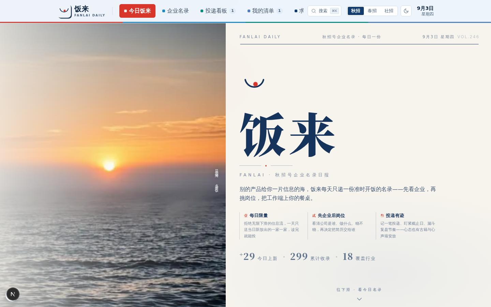
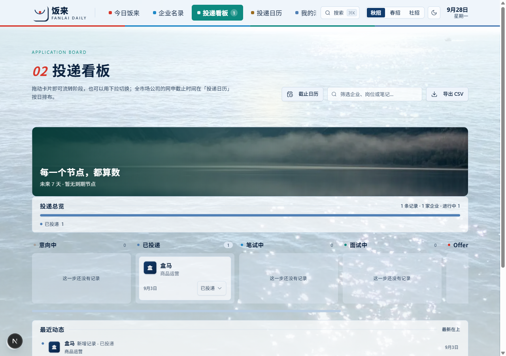

# 饭来 FanLai

   

> 每天一份准时开饭的秋招名录——先看企业，再挑岗位，投递有迹，截止不慌。

饭来是一个本地优先的秋招求职管理应用：**每日一份「先企业后岗位」的招聘名录**，配套企业名录、投递看板、截止日历与数据可信度分层，内置 **18 个行业 300+ 家企业**的真实整理数据，开箱即用。



## 功能

| 模块 | 说明 |
|---|---|
| **今日饭来** | 每日一份当日新放出的招聘企业，限量整理，看完就能投 |
| **企业名录** | 行业筛选 / 关键词搜索，先看清企业再决定投递 |
| **投递看板** | 拖拽流转（意向 → 投递 → 笔试 → 面试 → Offer），支持 CSV 导出 |
| **投递日历** | 网申截止按日排布；机器探测官网可达性 + 每日 3 家亲核打卡，可信度分层标注 |



## 快速开始

要求 Node.js 20+。

```bash
npm install
cp .env.example .env   # Windows: copy .env.example .env
npm run dev
```

打开 http://localhost:3000 即可。数据库零配置（SQLite，仓库自带演示数据）。

Windows 也可直接双击 `启动饭来.bat`。

## 技术栈

Next.js 16（App Router / Turbopack）· React 19 · TypeScript · Tailwind CSS v4 · shadcn/ui · Prisma + SQLite

## 核心设计

- **数据可信度分层**：每条截止情报标注来源层级（官网来源 > 平台转载 > 转发渠道 > 已亲核），缺失情报如实展示「暂缺」——不装准确，比精确更重要
- **机器核查 + 人工打卡闭环**：机器自动探测招聘官网可达性；每天推荐 3 家最该亲核的企业，「去官网 → 我已核对」打卡后情报升级为最高可信层级
- **本地优先**：数据完全存在本地 SQLite，无账号、无上传，求职轨迹属于你自己

## 项目结构

```
FanLai/
├── src/app/            # App Router 路由（页面 + 20 个 API 端点）
├── src/components/     # UI 组件（fanlai 业务组件 + shadcn/ui）
├── src/lib/            # 数据库、调度器、官网探测、日期计算等核心逻辑
├── prisma/             # 数据库 schema
├── db/                 # SQLite 数据文件（内置演示数据）
├── public/             # 企业 logo、海浪背景视频等静态资源
├── docs/screenshots/   # 产品截图
└── scripts/            # 数据整理与运维脚本
```

## 说明

- `db/custom.db` 为真实整理的演示数据（企业情报、官网探测结果、示例投递记录）
- 每日名录的自动联网同步需要特定 SDK 环境，默认关闭；记录、核对、看板、日历等核心功能不受影响
- 截止日期的机器探测只保证「官网可达」，不保证「日期准确」——这正是产品把「亲核打卡」设计为最高可信层级的原因

## License

[MIT](LICENSE)
