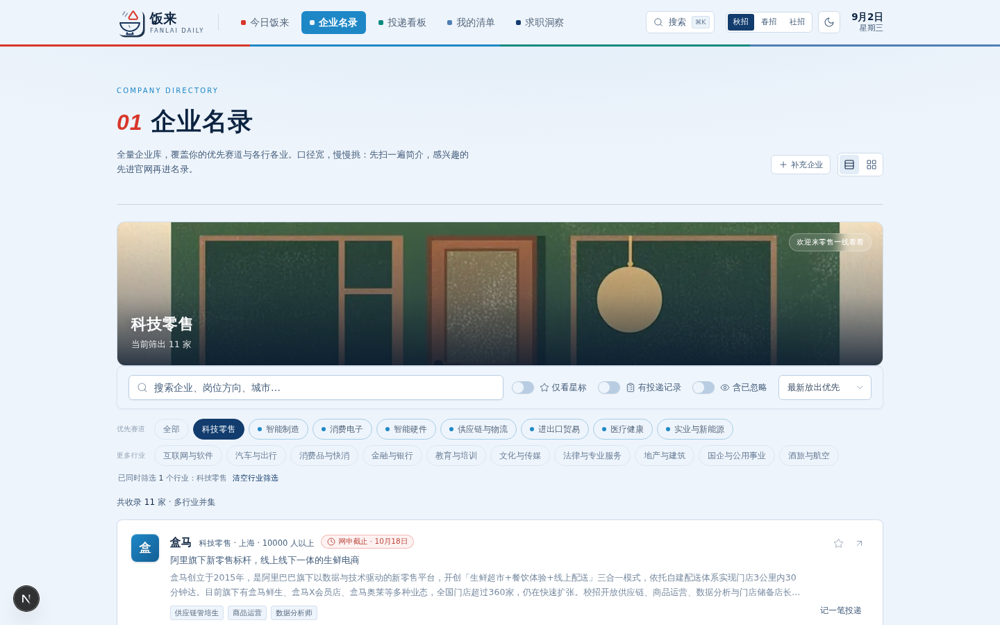
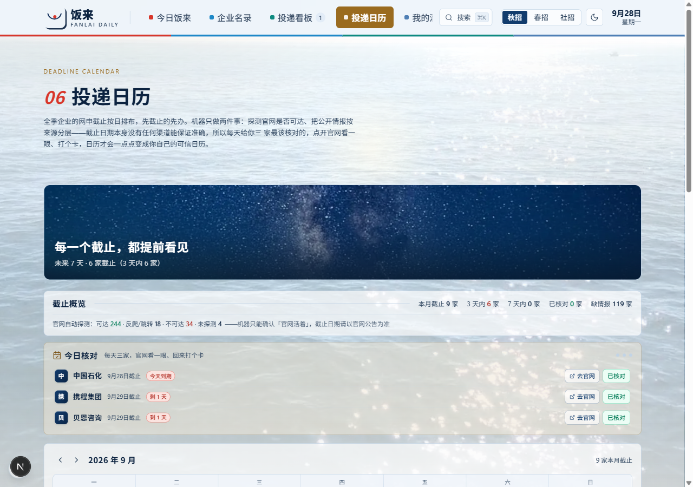
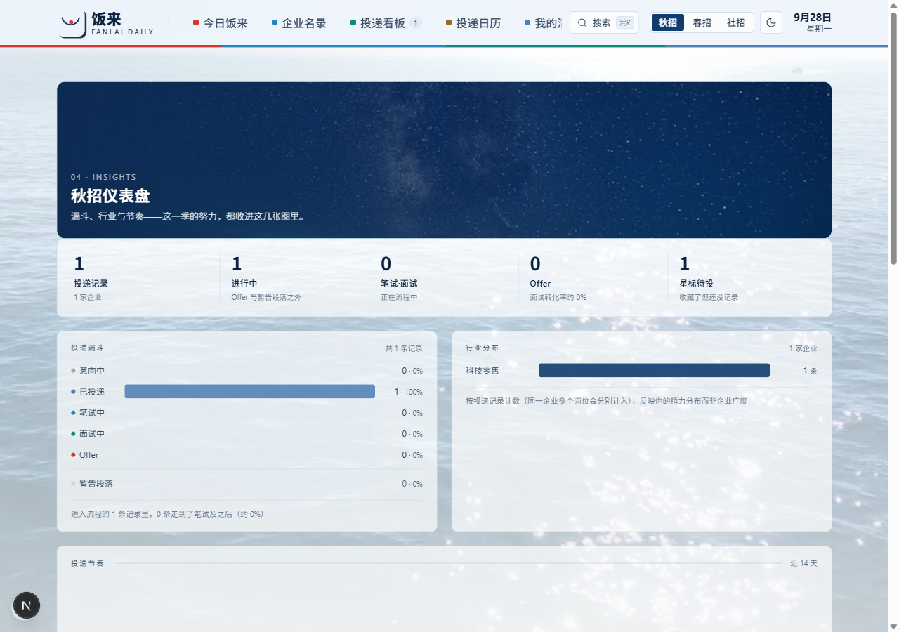
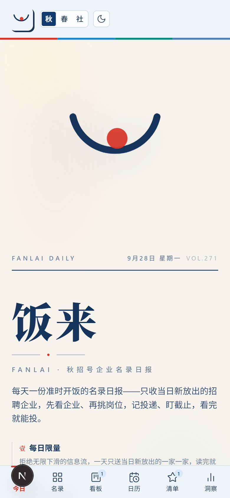
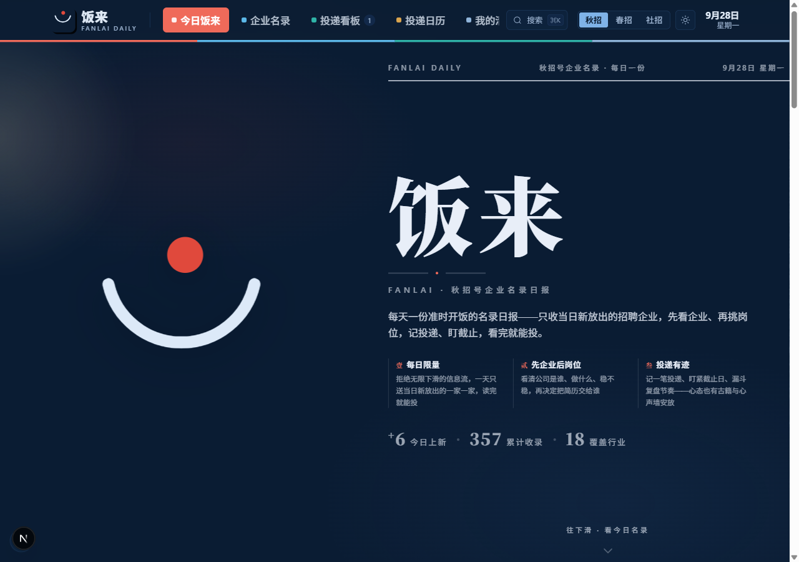

<div align="center">

# 饭来 FanLai

**找工作就是找一碗饭。**

&nbsp; &nbsp; &nbsp; &nbsp; 


*每天一份准时开饭的秋招名录 —— 先看企业，再挑岗位，投递有迹，截止不慌。*

[快速开始](#快速开始)&nbsp;·&nbsp;[功能总览](#它能帮你做什么)&nbsp;·&nbsp;[几个诚实的原则](#几个诚实的原则)&nbsp;·&nbsp;[它是怎么做出来的](#它是怎么做出来的)&nbsp;·&nbsp;[License](#license)

</div>

---

## 为什么是饭来

秋招和春招，大概是学生时代最漫长的一场考试。

就业的大环境并不友好，它推着每一个人不得不主动出击、去打破信息壁垒；而「人人都在冲刺」的氛围，又反过来加剧了焦虑和内卷。信息不是太少，而是太碎、太吵——你刷得到无数篇经验帖，却很难看到一份干净、诚实、按日排好的企业名录。

饭来就是在这样的心情里做出来的小产品：把信息老老实实罗列出来，先看企业、再挑岗位，记下每一次投递、盯住每一个截止日。它尤其想帮到那些**职业规划还没有完全定型、愿意多尝试不同渠道、想多了解不同行业和企业**的人——不必一次就想清楚一辈子，先把今天的三家投了再说。

> 找工作就是找一碗饭。主动出击的人，值得准时开饭。

---

## 它能帮你做什么

### 🗂 企业名录 · 先看清楚，再交简历

<div align="center">

</div>

> 357 家企业、18 个行业，行业筛选 + 关键词搜索。每条情报都标注来源与「待核 / 已核」状态，先把公司是谁、做什么、稳不稳看清，再决定把简历交给谁。

### 📋 投递看板 · 拖一张卡，就是一次流转

<div align="center">

</div>

> 意向 → 投递 → 笔试 → 面试 → Offer，拖拽即流转，历史轨迹自动留痕，支持一键导出 CSV。全季网申截止在旁边按日排布，先截止的先办。

### 📅 投递日历 · 机器核查，人工打卡

<div align="center">

</div>

> 机器自动探测招聘官网可达性，但明确告诉你它只能确认「官网活着」；每天给出三家最该亲核的企业，点开官网看一眼、回来打个卡——打卡过的情报，才是你自己的情报。

### 📊 求职洞察 · 节奏也是竞争力

<div align="center">

</div>

> 投递漏斗、节奏复盘，还有古籍与心声墙——找工作是一场持久战，心态也要有地方安放。

### 📱 移动端 · 深色模式

<div align="center">
<table><tr>
<td></td>
<td></td>
</tr></table>
</div>

> 左：手机上的今日饭来；右：深夜刷名录不刺眼的暗色模式。跟随系统主题自动切换。

---

## 快速开始

要求 Node.js 20+。

```bash
npm install
cp .env.example .env   # Windows: copy .env.example .env
npm run dev
```

打开 <http://localhost:3000>。数据库零配置（SQLite，仓库自带演示数据，开箱即用）。

Windows 也可以直接双击 `启动饭来.bat`。

> **关于自动名录同步**：`FANLAI_DISABLE_AUTO=1` 会关掉每日名录的自动联网同步，该功能需要特定 SDK 环境，默认不开。记录、核对、看板、日历等核心功能不受影响——你拿到的是一份完整可用的工具，只是不带自动更新。
>
> 可选环境变量见 `.env.example`，不配也能跑（Prisma 会回落到 `db/custom.db`）。

---

## 它是怎么做出来的

这是一个 AI 协作项目：**GLM 5.3-flash 出初稿源码包，WorkBuddy 做后续精修**。

分工是清晰的——人负责架构、设计与用户视角（产品功能、配色与风格、功能愿景），AI 负责检索、信息整合与执行实现（方案设计、初稿落地）。几个真实踩过的坑：

- **海浪背景换过三次实现路径**。先用 Blender 生成 3D 海浪，僵硬且难看；改 2D 违背了「实拍」需求；最终改为直接使用 Pexels 授权实拍视频素材（`public/videos/`，四段共约 52 MB）。视频铺满全页后前景文字半透明效果始终有缺漏，毛玻璃调了很多轮；按太阳直射点与实时北京时间切换的素材质量也不一致。
- **每日推送的信息准确性**靠三层保障：先固定几个可靠信源作基准，再让 AI 设计交叉比对机制，最后叠一层人工核验。
- **功能定位返工过**。初版功能单一、市面同类产品也多，一度在看板与日历之外又加了社区论坛，仍不满意。后来想清初衷：服务那些职业规划未定、愿意主动出击、希望岗位适配自己而非自己适配岗位、却被海量信息卡住的同学——「找工作就是找一碗饭」，产品才立住。
- **工程周期被拉长**，因为推理与算力要等，且涉及海量信息与多模态输入。应对方式是把产品设计和功能拆开、排出优先级、按批次交付，减少反复返工。

README 之所以能写成这样，是因为它在意的从来不只是「能跑起来」。

---

## 几个诚实的原则

- **机器只做机器能保证的事。** 官网可达性自动探测可以告诉你「这个域名活着」，但没有任何渠道能保证「截止日期准确」。所以每天只给你三家最该亲核的，点开官网看一眼、回来打个卡——打卡过的情报，才是你自己的情报。
- **每条情报都有出处。** 来源分层标注（官网来源 > 平台转载 > 转发渠道 > 已亲核），缺的如实写「暂缺」，不装准确。
- **数据留在你自己手里。** 本地 SQLite，无账号、无上传，求职轨迹属于你自己。

---

## 技术栈

<div align="center">

&nbsp; &nbsp; &nbsp; &nbsp; &nbsp; &nbsp; 

Next.js 16（App Router / Turbopack）· React 19 · TypeScript · Tailwind CSS v4 · shadcn/ui · Prisma + SQLite

</div>

## 项目结构

```
FanLai/
├── src/app/            # App Router 路由（页面 + 20 个 API 端点）
├── src/components/     # UI 组件（fanlai 业务组件 + shadcn/ui）
├── src/lib/            # 数据库、调度器、官网探测、日期计算等核心逻辑
├── prisma/             # 数据库 schema
├── db/                 # SQLite 数据文件（内置演示数据）
├── public/             # 企业 logo、海浪背景视频等静态资源
├── docs/screenshots/   # 产品截图
└── scripts/            # 数据整理与运维脚本
```

## 说明

- `db/custom.db` 内置真实整理的演示数据（企业情报、官网探测结果、示例投递记录）
- 仓库体积主要来自 `public/videos/` 的四段实拍海浪视频（约 52 MB）；应用代码本身约 1.2 MB。视频为 Pexels 免费商用授权素材
- 每日名录的自动联网同步需要特定 SDK 环境，默认关闭；详见[快速开始](#快速开始)

---

<div align="center">

*饭来 · 秋招志 —— 今天也要好好吃饭，好好上岸。*

[MIT License](LICENSE) © 2026 rRochee

</div>
